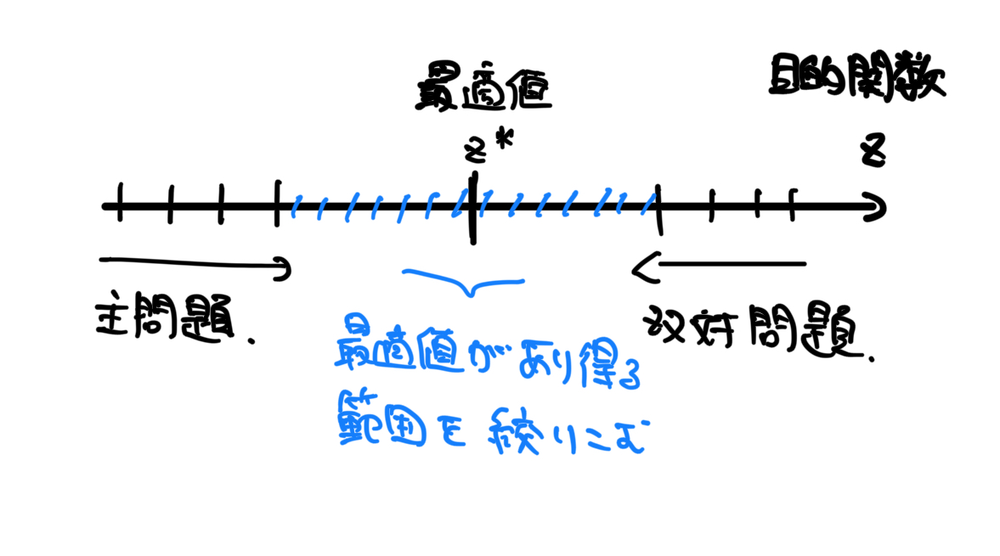

# 双対問題

最適解に逆側から迫るのが双対問題。LPには必ず双対問題が存在する。

## モチベーション

LPとして、最大化問題を考える。
このとき、最適値が求まればいいか、簡単に求まらないことも多い。そんなとき、とりあえず**これよりは大きくならない**と言えると便利である。つまり、**上界**を求められると便利である。ざっくりとしたイメージとしては、最適解がある範囲を少しづつ絞っていくようなイメージである。

そのようにして逆から最適値に近づいていくような問題を考えたい。

## 双対問題を導出する

主問題を
$$\begin{align}\max &: \sum_{j=1}^nc_jx_j \\ s.t.&: \sum^n_{j=1}a_{ij}x_j \le b_i, \;x_j\ge 0\end{align}$$
とする。制約条件を係数をかけて足し合わせることで
$$\sum^m_{i=1}y_i\left(\sum^n_{j=1}a_{ij}x_j\right)\le \sum^m_{i=1}y_ib_i$$
としてみる。左辺を$x$についてまとめて、
$$\sum^n_{j=1}x_j\left(\sum^m_{i=1}a_{ij}y_i\right) \le \sum^m_{i=1}y_ib_i$$
とする。左辺で$\sum^m_{i=1}a_{ij}y_i \ge c_j$を満たせば
$$\sum^n_{j=1}x_jc_j \le \sum^n_{j=1}x_j\left(\sum^m_{i=1}a_{ij}y_i\right) \le \sum^m_{i=1}y_ib_i$$
となって、**上界が求まる**。
この$y_i$を変数として次のようなLP
$$\begin{align}\min &: \sum^m_{i=1}y_ib_i \\ s.t.&: \sum^m_{i=1}a_{ij}y_i\ge c_j,\; y_i\ge 0\end{align}$$
を考える。これが双対問題である。これを解くことで上の不等式の左辺をどんどんと小さくすることができて、最適値を上から抑えることができる。

## 弱双対定理

上の手順で双対問題を導出していれば自明だが
$$\sum^n_{j=1}c_jx_j \le \sum^m_{i=1}b_iy_i$$
が成り立つ。証明は双対問題の導出をなぞればいい

## 双対定理

強双対定理ともいう

主問題と双対問題が**両方とも実行可能なら**、最適解$x^*,y^*$は存在して
$$\sum^n_{j=1}c_jx_j^* = \sum^m_{i=1}b_iy_i^*$$
が成り立つ。

## 相補性定理

実行可能解$x^*,y^*$が最適解であることの必要十分条件は
$$\begin{cases}\forall j\;\sum^m_{i=1}a_{ij}y_i^*=c_j または\;x_j^*=0 \\ \forall i \; \sum^n_{j=1}a_{ij}x_j^*=b_iまたは\;y^*_i=0\end{cases}$$
が成り立つことである。これを使うことで、主問題と双対問題の**いずれかの最適解がわかれば、もう一方の最適解も求められる可能性がある。

別の書き方をすると
$$x_j\left(\sum^m_{i=1} a_{ij}y_j - c_j\right)=0,\quad (j=1,...,n)$$
と書くこともできる。シンプルだが、使うときは上の形で使うことになる

## 参考文献

- 梅谷俊治(2020),『しっかり学ぶ数理最適化　モデルからアルゴリズムまで』, 講談社サイエンティフィク
- 講義資料（非公開）
