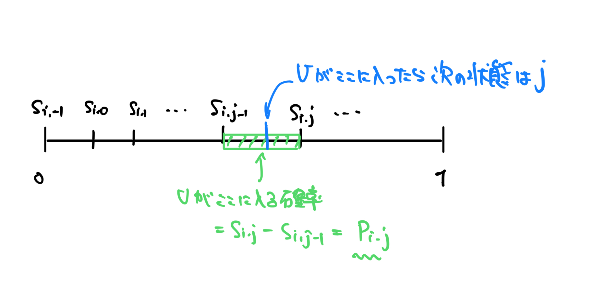

# 確率再帰

**任意の**マルコフ連鎖は、一様ランダムな確率変数と関数を使うことで表現できる
この表現を使うことで、確率的な部分をランダムな確率変数になすりつけることができる

$\{X_n\}_{n\in \mathbb N_0}$を状態空間$\mathcal S$上のマルコフ連鎖として、$P=(p_{i,j})_{i,j\in \mathcal S}$を推移確率行列とすると、ある関数$f: \mathcal S \times [0,1] \to \mathcal S$が存在して
$$X_{n+1} = f(X_n, U_{n+1}),\quad n\in\mathbb N_0$$
とできる。ここで確率変数$U_{n+1}$は$[0,1]$上の一様分布に従うものとする。

関数$f$の

- 第1引数が、現在の状態の情報を
- 第2引数が、ランダムさを
それぞれ提供している。

## 確率再帰で表現できることの証明

$\mathcal S = \mathbb N_0$とする。
$$\forall i\in \mathbb N_0,s_{i,-1}:=0,\quad s_{i,j}:=\sum^j_{k=0}p_{i,k},\quad (j=0,1,2,...)$$
のようにして$s_{i,j}$を定める。
この$s_{i,j}$は、現在状態$i$にいて、次の瞬間に$0,1,...,j$のいずれかに行く確率を表している。

$a,b \in [0,1] \;(a\le b)$に対して$P(U\in (a,b]) = b-a$なので
$$f(i,u) := \sum_{j\in\mathbb N_0} j\mathbf 1_{(s_{i,j-1},s_{i,j}]} (u), \quad i\in\mathbb N_0,u\in[0,1]$$
と定めると
$$P(X_{n+1}=j\mid X_n=i) =P(U_{n+1}\in (s_{i,j-1},s_{i,j}])=p_{i,j}$$
となる。

