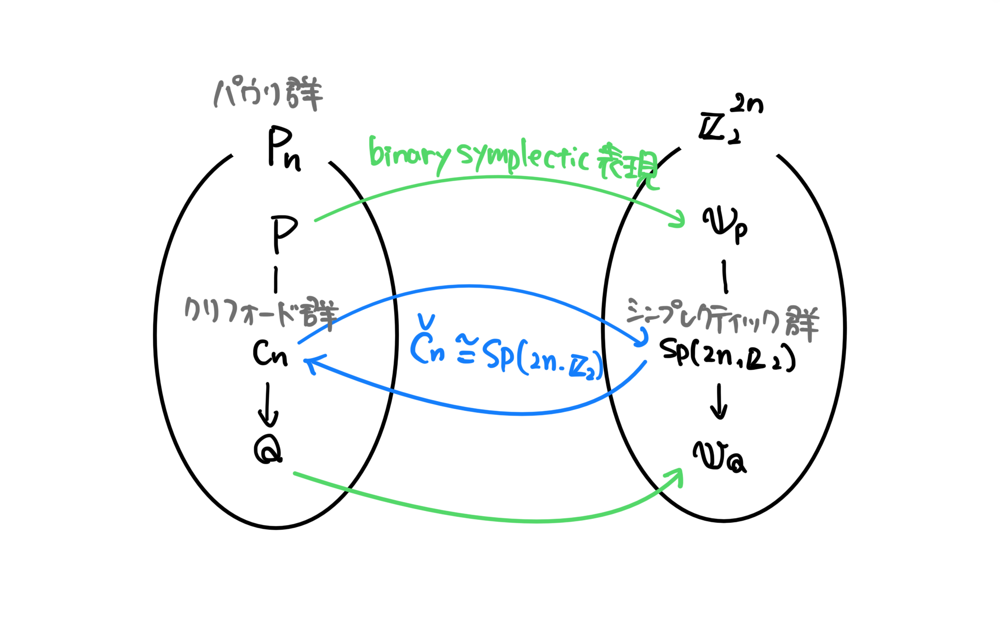

# binary symplectic表現

シンプレクティックベクトル空間をつかったパウリ群の表現

$\hat P_n$の**binary symplectic表現**とは、$\hat P_n$から$\mathbb Z_2^n\times \mathbb Z_2^n$への同型であり、
$$P \leftrightarrow v_P=(x_P|z_P)$$
のような形で、$P$の$i$番目の演算子$P_i$に応じて
$$(x_{P_i}|z_{P_i})=\begin{cases}(0|0)&P_i=I \\ (1|0)&P_i=X\\(1|1) & P_i=Y\\(0|1)&P_i=Z\end{cases}$$
と対応させるもののことである。

具体例として、$X\otimes Y \otimes I$をbinary symplectic表現で表すと、
$$X\otimes Y\otimes I \mapsto (1\;1\;0|0\;1\;0)$$
となる。

対応関係は次の通り

| パウリ群              | Binary symplectic表現                                    |
| ----------------- | ------------------------------------------------------ |
| $P\in P_n$        | $v_P=(x_P\mid z_P)\in\mathbb Z^n_2\times\mathbb Z^n_2$ |
| 積 $\cdot$         | 和 $+$                                                  |
| $c(P,Q)$          | $v_P\odot v_Q$                                         |
| 位相                | ない                                                     |
| stabilizer $S$    | 弱自己双対部分空間 $S$                                          |
| normalizer $N(S)$ | 双対部分空間 $S^{\perp}$                                     |
| $S$ の最小の生成系       | $S$ の基底                                                |
| クリフォード群           | シンプレクティック群                                             |

## モチベーション

パウリ群$\text P_n$を考えるときに、**位相は無視したいが、交換関係は使いたい**という場面がよくある。実際に、位相を考えるのはしんどい割に本質的じゃないことが多い。$X, -X, iX, -iX$を一緒に扱いたいけど、ナイーブにやると$XY=-YX$のような関係を記述できなくなる。

そこで、一旦位相は無視して$\hat P_n$を考えて、交換関係については$c(P,Q)$の情報を引き継ぐことで表現しようと考える。その要求にドンピシャなのがbinary symplectic表現になっている。

パウリ群の代わりにbinary symplectic表現を考えることで、線形空間の言葉で記述できるようになり、例えば

- パウリ群の積 → ビット列の和（XOR）
- スタビライザ群$S$の生成系 → 部分空間$S$の基底

のような言い換えが可能になる。パウリ群における計算の多くがXORで置き換えられるので古典コンピュータでのシミュレーションも容易になる。（行列の積をハッシュテーブルで持っておけばパウリ群で計算しても計算量は変わらないと思われる）

パウリ群からbinary symplectic表現への変換の全体像は次の図のようになる。

## 双対空間

$\mathbb Z_2^n\times \mathbb Z_2^n$の部分空間$V$について、$V$の**双対空間**$V^{\top}$は
$$V^{\top}=\{w\in\mathbb Z_2^n\times \mathbb Z_2^n \mid w \odot v=0\;(\forall v\in V)\}$$
で定義される部分空間である。また、
$$V = V^{\top}$$
をみたすなら**自己双対**といい、
$$V\subseteq V^{\top}$$
をみたすなら**弱自己双対**という。

これら双対空間に関する概念を使うことで、**スタビライザ群やノーマライザをbinary symplectic表現の言葉で記述することができる**。

まず、スタビライザ群が弱自己双対部分空間に対応することを見る。$\mathbb Z_2^n\times \mathbb Z_2^n$の部分空間$S$が
$$S \subseteq S^{\top}$$
をみたすとする。これがスタビライザ群に対応することを確認するために、$S$に対応する$\hat P_n$の部分群が可換群であることを確認する。$S\subseteq S^{\top}$より任意の$v,u \in S$について
$$v\odot u = 0$$
が成り立つ。つまり、$S$の要素はすべて可換である。なので、$S$が弱自己双対ならスタビライザ群に対応する。

続いてノーマライザについて見る。スタビライザ群$S$に対するノーマライザ$N(S)$は
$$N(S) = \{N \in \text P_n \mid MN=NM \;(\forall M \in S)\}$$
と定義される。つまり、$S$の要素と可換な演算子の集まりである。可換であるということはbinary symplectic表現では
$$v\odot u = 0$$
と書けるので、
$$S^{\top}=\{w \in \mathbb Z_2^n \times \mathbb Z_2^n\mid w\odot v = 0\;(\forall v \in S)\}$$
は$N(S)$に対応することになる。

## 参考文献

- [Gottesman] Daniel Gottesman, "Surviving as a Quantum Computer in a Classical World", https://www.cs.umd.edu/class/spring2024/cmsc858G/QECCbook-2024-ch1-15.pdf