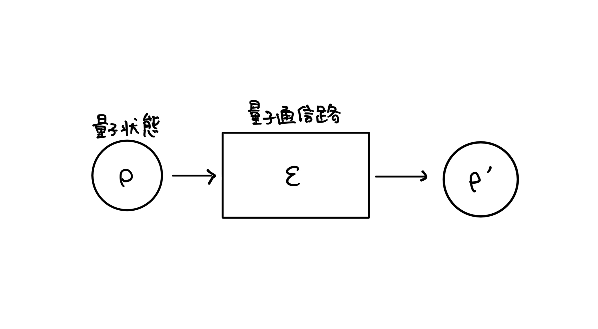

# 量子情報理論

情報理論の量子版。と言ってしまうとちょっと違うのかもしれないけど、ここで書く予定なのはシャノンの情報理論の量子版（量子シャノン理論と呼ばれることもあるらしい）。

量子情報理論での基本設定は次のような通信路のモデル。

問題設定によって、量子通信路を色々と組み合わせてモデルを考える。

古典の情報理論では、確率変数を入出力にもつような通信路を考えて、通信路の容量を測ってみたり、ノイズが入るとどうなるか考えてみたりする。情報理論の根幹は確率論で、数理統計学みたいな立ち位置な気がする。

一方の量子情報理論では、量子状態とその間の操作を考える。量子状態はたくさんの確率分布がお互いに干渉しながら集まっているもの。その点で、古典情報理論よりも広い状況を考えている（確率分布を1つに固定すれば古典情報理論と同じように扱えるはず）

## 基本的な概念

議論の対象となるのは主に次の２つ。

- [量子状態](./quantum-state.md)
- [量子通信路](./quantum-channel.md)

これらの対象の性質について色々と考えることになる。イメージとしては、集合と写像くらい基本的。

## 基本的な道具

量子情報理論でいろいろな分析をシていくうえでの道具がいろいろある。

### 何かを測る量

量子状態に関して定義される量として、

- von Neumannエントロピー
- 量子相対エントロピー
- トレースノルム
- フィデリティ

などがある。

量子通信路に関して定義される量として、

- エンタングルメントフィデリティ
- ダイアモンドノルム

などがある。

### 代数的な道具

量子情報ではいろいろな概念が代数の言葉で記述される。中でも線形代数は言葉として使う。必須なのが

- [特異値分解](../../math/linear-algebra/singular-decomposition.md)
- 行列値関数

逆に、これさえ知っていれば言っていることは理解できるはず。基本的な線形代数の話題については[線形代数](../../math/linear-algebra/index.md)でまとめるかも（基本的なことが多くてメモがないから更新は後回しになるはず）

量子情報ではいろいろな線形演算子を利用する。代表的なものとして

- 有界作用素：量子情報で出てくる演算子はどれも有界作用素
- エルミート演算子：有界作用素で$O^{\dagger} = O$をみたす
- 半正定値演算子：固有値がすべて非負のエルミート演算子
- 射影演算子：$\Pi ^2 = \Pi$をみたすエルミート演算子
- ユニタリ：有界作用素で$U^{\dagger} U = I$をみたす
- アイソメトリ：$V \in \mathcal B(\mathcal H ,\mathcal K)$で$V^{\dagger}V = I\in \mathcal B(\mathcal H)$をみたす
- 部分アイソメトリ：$V \in \mathcal B(\mathcal H ,\mathcal K)$で$V^{\dagger}V$が射影演算子になっている

などがある。

## 量子情報の定理あるある

量子情報で重要な定理は
$$\begin{align}(条件下で最小化または最大化して達成される操作的な量の漸近極限) \\ =(1つのエントロピー的な量から定まる内在的な量) \end{align}$$
という形で述べられる。この形式は確率論の**大偏差原理**と類似している。

このような定理によって、**エントロピー的な量に対して操作的な意味を与える**ことができる。内在的な量として

- 量子Steinの補題における量子相対エントロピー
- $D_{\alpha}(0\le \alpha < 1)$で定まるChernoff限界
- $D_{\alpha}(0< \alpha < 1)$で定まるHoeffding限界
- $\tilde{D_{\alpha}}(\alpha > 1)$から定まる逆型Hoeffding限界
- 量子相対エントロピーで定まるHolevo容量

このような定理の大元となっている問題は

- 量子仮説検定
- 量子通信路符号化

などである